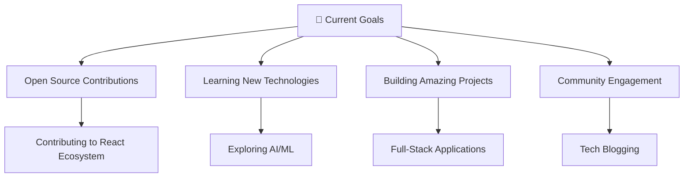

# 👋 Hey there! I'm Raje Abhilash

<div align="center">
  
</div>

<div align="center">
  
  [](https://github.com/rajeabhilash)
  [](https://github.com/rajeabhilash)
  [](https://github.com/rajeabhilash)
  
</div>

---

## 🚀 About Me

```javascript
const rajeAbhilash = {
    pronouns: "He/Him",
    location: "🌍 India",
    currentlyWorking: "Building amazing applications",
    currentlyLearning: ["LLM & MLOps", "Distributed Data [Blockchain]", "Cloud Architecture"],
    askMeAbout: ["Anything Python","Cross Platform Development", "ML Models & Ops", "Product Design", "Open Source"],
    funFact: "I debug code in my dreams! 🐛💭"
};
```

<div align="center">
  
  🔭 I'm currently working on **exciting projects**  
  🌱 I'm currently learning **new technologies**  
  👯 I'm looking to collaborate on **open source projects**  
  💬 Ask me about **anything tech-related**  
  📫 How to reach me: **Let's connect below!**  
  ⚡ Fun fact: **Coffee + Code = Perfect Combination** ☕💻
  
</div>

---

## 🛠️ Tech Stack

<div align="center">

### Languages


### Frontend


### Backend


### Database


### Cloud & DevOps


</div>

---

## 📊 GitHub Analytics

<div align="center">
  
  
</div>

<div align="center">
  
</div>

<div align="center">
  
</div>

---

## 🏆 Featured Projects

<div align="center">

[](https://github.com/rajeabhilash/PROJECT_NAME_1)
[](https://github.com/rajeabhilash/PROJECT_NAME_2)

</div>

### 🌟 Recent Work
<!-- PROJECTS:START -->
- 🔥 **[Project 1]** - Brief description of your awesome project
- 🚀 **[Project 2]** - Another cool project you're working on
- 💡 **[Project 3]** - Innovative solution you've built
<!-- PROJECTS:END -->

---

## 🏅 Achievements & Trophies

<div align="center">
  
</div>

---

## 📈 Contribution Graph

<div align="center">
  
</div>

---

## 🌐 Connect With Me

<div align="center">

### 📱 Social Media & Professional Networks
[](https://linkedin.com/in/rajeabhilash)
[](https://twitter.com/rajeabhilash)
[](https://instagram.com/rajeabhilash)
[](https://facebook.com/rajeabhilash)

### 💼 Professional Platforms
[](https://github.com/rajeabhilash)
[](https://gitlab.com/rajeabhilash)
[](https://stackoverflow.com/users/rajeabhilash)
[](https://leetcode.com/rajeabhilash)
[](https://hackerrank.com/rajeabhilash)
[](https://codepen.io/rajeabhilash)

### 🎥 Content & Community
[](https://youtube.com/@rajeabhilash)
[](https://twitch.tv/rajeabhilash)
[](https://discord.gg/rajeabhilash)
[](https://reddit.com/user/rajeabhilash)

### 📝 Writing & Blogging
[](https://medium.com/@rajeabhilash)
[](https://dev.to/rajeabhilash)
[](https://hashnode.com/@rajeabhilash)

### 💬 Communication
[](https://t.me/rajeabhilash)
[](https://wa.me/rajeabhilash)
[](https://slack.com/rajeabhilash)

### 🎵 Entertainment & Others
[](https://open.spotify.com/user/rajeabhilash)
[](https://pinterest.com/rajeabhilash)
[](https://tiktok.com/@rajeabhilash)

### 📧 Direct Contact
[](mailto:rajeabhilash@gmail.com)
[](https://rajeabhilash.dev)

</div>

---

## 💝 Support My Work

<div align="center">

If you like my work and want to support me, consider:

[](https://buymeacoffee.com/rajeabhilash)
[](https://ko-fi.com/rajeabhilash)
[](https://paypal.me/rajeabhilash)
[](https://patreon.com/rajeabhilash)

⭐ **Star my repositories** if you find them useful!  
🍴 **Fork and contribute** to open source projects!  
📢 **Share my work** with others!

</div>

---

## 🎯 Current Focus

<div align="center">



</div>

---

## 📅 Weekly Development Breakdown

<!--START_SECTION:waka-->
```text
JavaScript   8 hrs 12 mins   ████████████░░░░░░░░░   48.2%
Python       4 hrs 23 mins   ██████░░░░░░░░░░░░░░░   25.8%
TypeScript   2 hrs 45 mins   ████░░░░░░░░░░░░░░░░░   16.2%
CSS          1 hr 8 mins     █░░░░░░░░░░░░░░░░░░░░    6.7%
HTML         32 mins         █░░░░░░░░░░░░░░░░░░░░    3.1%
```
<!--END_SECTION:waka-->

---

<div align="center">
  
## 🎨 Profile Art

```
     ╔═══════════════════════════════════════════════════════════════╗
     ║                        Raje Abhilash                         ║
     ║                   Full Stack Developer                       ║
     ║                                                               ║
     ║  "Code is like humor. When you have to explain it,           ║
     ║   it's bad." - Cory House                                    ║
     ╚═══════════════════════════════════════════════════════════════╝
```

### ⚡ Quick Stats
- 🔭 **Years of Coding:** Passionate developer since day one
- 🌱 **Current Learning:** Always exploring new technologies
- 💼 **Open for:** Collaborations, opportunities, and interesting projects
- 🎯 **Goal:** Building impactful software solutions

</div>

---

<div align="center">
  
### 🐍 Contribution Snake


</div>

---

<div align="center">

### 💫 Random Dev Quote


</div>

---

<div align="center">

**✨ Thanks for visiting my profile! Have a great day! ✨**


</div>

---

<div align="center">
  <i>⭐️ From <a href="https://github.com/rajeabhilash">rajeabhilash</a></i>
</div>
